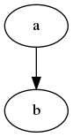

# picoCharts
Pico CMS plugin to show charts or graphs **dynamically** and **easily** by Graphviz.

* [Installation](#installation)

## Installation
This plugin needs [Graphviz](https://graphviz.org/)

Please install Graphviz before install this plugin. 

* Debian, Ubuntu... `apt install graphviz`
* RHEL, CentOS...   `dnf install graphviz`

Copy the 'PicoCharts.php' file to the 'plugins/' directory of your Pico Project.

## Usage

Put DOT formats file to your content direcory.

## DOT file example

```
digraph g {
    graph [];
    node [];
    edge [];
    a -> b;
}
```


